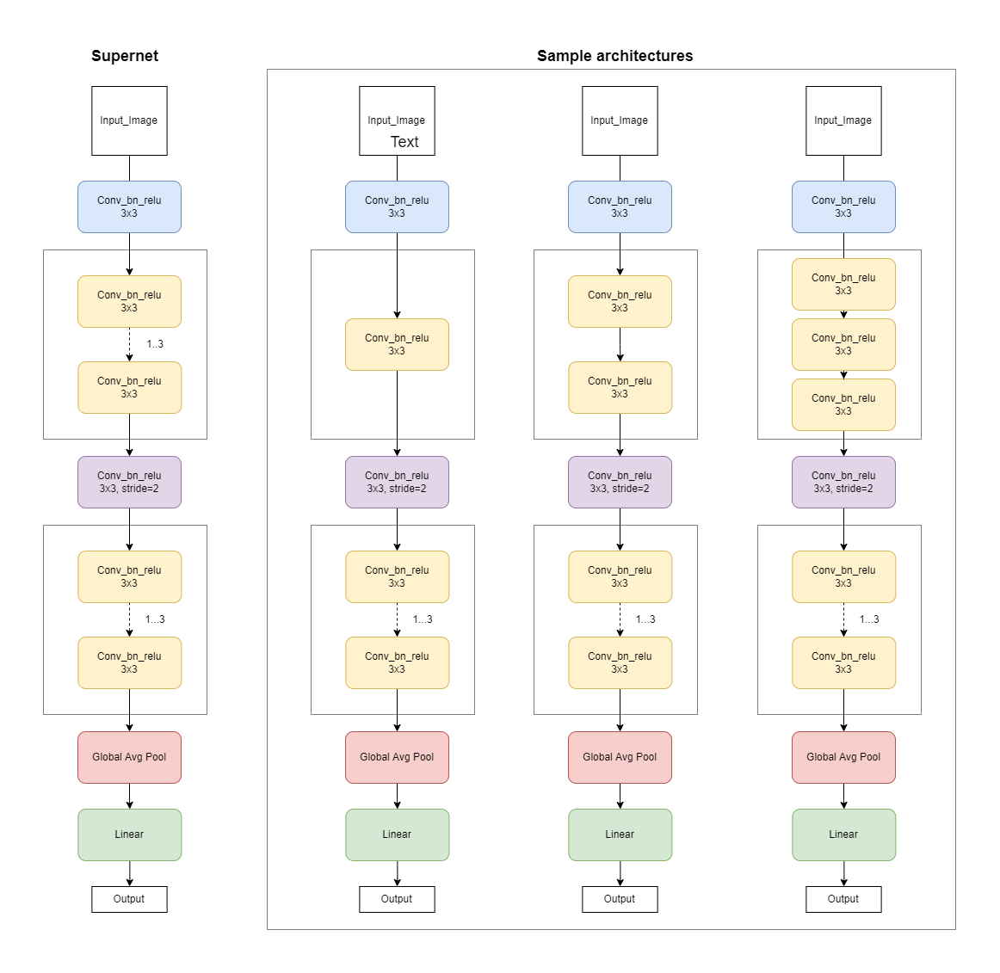
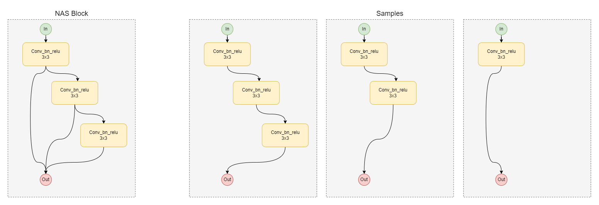
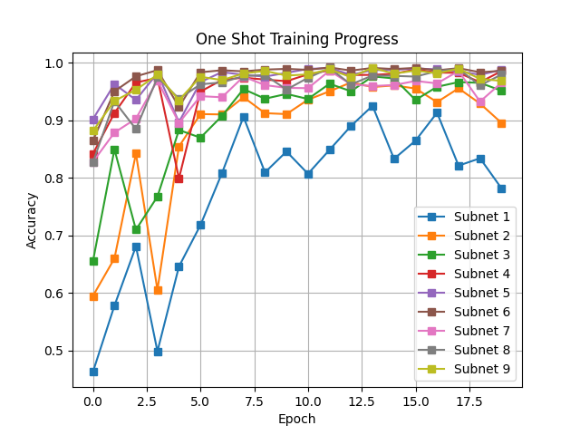
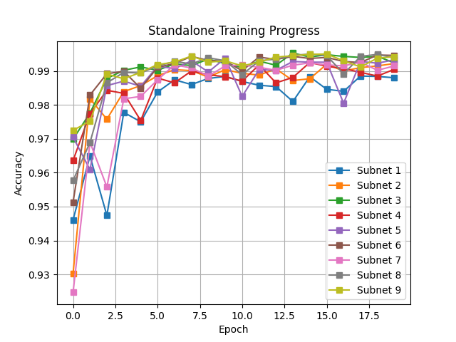
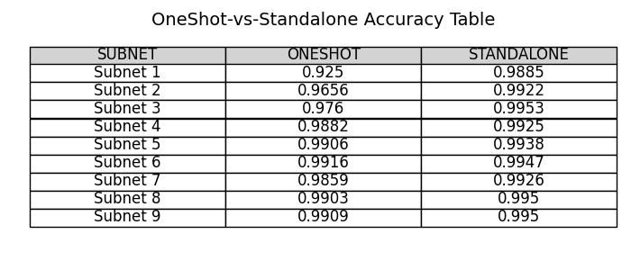

# One-Shot Neural Architecture Search

This repository contains code for training a SuperNet using one-shot neural architecture search (NAS) on the MNIST dataset. One-shot NAS is a technique for automatically discovering high-performing neural network architectures by training a single "SuperNet" that contains all possible sub-networks, and then evaluating the performance of each sub-network on a validation set. 

This approach can significantly reduce the computational cost of architecture search, as it requires training only one network instead of many. In this project, we use a SuperNet that contains 9 different architectures, and compare the accuracy and training time of sub-networks trained using the SuperNet to those trained independently.

## Task

The task at hand is to train a SuperNet on the MNIST dataset using 9 different architectures and compare its performance with independently trained networks.

## SuperNet Structure

The SuperNet is a set of different layers, as shown in the figure below. The architectures that can be obtained from the SuperNet are shown on the right-hand side of the figure when changing the first block.

The convolutions located in the variable-length block (highlighted in yellow) do not change the height and width of the input tensor, as well as the number of channels.

For variable-length blocks, the sequence of convolutions is fixed, there are no gaps or changes in the order of convolutions in the block (Allowed: 1, 1-> 2, 1-> 2-> 3; NOT allowed: 2, 3, 2-> 3, 1-> 3, 2-> 1, 3-> 2-> 1, etc.)

The figure below shows the architecture of the variable block of the SuperNet, as well as its specific implementations.

## Script Structure

The script that runs the training and testing is located in the `main.py` file. It calls the `train_test` function from the `train_test` module, passing an instance of the `SuperNet` class as an argument. After training and testing the SuperNet, the script calls the `train_test` function for each of the 9 possible subnets, passing an instance of `SuperNet` and the corresponding subnet index as arguments.

# How to Run the Script
To add this repository to your local machine, you can follow these steps:

**Step 1.** Clone the repository by running the following command in the terminal:
`git clone https://github.com/nik1everyday/OneShotNeuralArchitectureSearch.git`

**Step 2.** Navigate to the repository directory:
`cd OneShotNeuralArchitectureSearch`

**Step 3.** Install the required dependencies using Poetry:
`poetry install`

This will install all the required dependencies specified in the pyproject.toml file.

**Step 4.** Run the script by calling the following command in the terminal:
`python main.py`
This will train and test the SuperNet and each of the 9 subnets on the MNIST dataset, and generate the accuracy results and comparison table.

Note that if you add or remove dependencies from the pyproject.toml file, you will need to re-run poetry install to update the virtual environment with the new dependencies.

# Results

The SuperNet and each of the 9 subnets were trained and tested on the MNIST dataset. The accuracy results for each subnet obtained during the experiments are presented below.

## Subnets Architecture 

| _Subnet_ | *# convs in NASBlock1*| *# convs in NASBlock2*|
|----------|:-:|:-:|
| Subnet 1 | 1 | 1
| Subnet 2 | 1 | 2
| Subnet 3 | 1 | 3
| Subnet 4 | 2 | 1
| Subnet 5 | 2 | 2
| Subnet 6 | 2 | 3
| Subnet 7 | 3 | 1
| Subnet 8 | 3 | 2
| Subnet 9 | 3 | 3

## One Shot Subnets

## Standalone Subnets

## Comparison Table

From the experiment results, it can be seen that the subnets trained using the SuperNet achieve comparable accuracy to independently trained subnets but train significantly faster. However, the accuracy of the subnets trained using the SuperNet may be slightly lower than the accuracy of independently trained subnets.

# Conclusion

Our experiments with one-shot neural architecture search (NAS) on the MNIST dataset demonstrated that this technique can effectively identify high-performing neural network architectures while minimizing computational cost. However, we also found that one potential challenge with one-shot NAS is selecting the best architecture from among many that achieve high accuracy.

During testing, some of our one-shot sub-networks achieved accuracy levels above 95%, with almost all sub-networks reaching 99% accuracy within 20 epochs. This presents a challenge when it comes to selecting the final architecture to use, as there may be multiple high-performing options to choose from.

Overall, our results suggest that one-shot NAS is a promising approach for optimizing neural network architectures, but that careful consideration must be given to selecting the best architecture when multiple high-performing options are identified. By carefully considering the trade-offs between accuracy, complexity, and other factors, we can effectively navigate the challenge of selecting the best architecture from among many high-performing options identified through one-shot NAS.

Future research could focus on developing methods for effectively selecting the best architecture in such situations, or on adapting one-shot NAS for use in other domains beyond image classification.

# References

1. Bender, G. (2018). "Understanding and Simplifying One-Shot Architecture Search". Retrieved from http://proceedings.mlr.press/v80/bender18a/bender18a.pdf

2. Dong, P. (2022). "Prior-Guided One-shot Neural Architecture Search". Retrieved from https://arxiv.org/pdf/2206.13329.pdf
